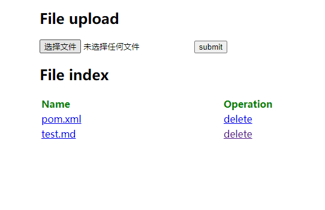

# websocket proxy

基于websocket的代理服务端和客户端

## 服务端和客户端的报文结构

channel id(8 bytes) + body length(4 bytes) + body(x bytes)

其中对body中的每一个字节使用channel id的第4个字节做了异或混淆（这个可以根据需要修改），这样client和server的网络中间层不会直接识别报文

## 开源框架

1. springboot
2. netty

## 环境

1. jdk8+

## 使用

### server端

springboot启动方式，参数修改可以在application.yml中，或者启动参数中添加spring参数，比如 修改端口添加 --server.port=80

server模块打包后启动命令：

```
java -jar server.jar 
```

linux后台运行：

```shell
nohup java -jar server.jar >> server.log 2>&1 &
```

server端还写了一个简单的实现文件上传、下载、查看、删除的接口列表和web页面



### client端

client端一般在windows平台使用，有两个协议实现

#### tcp client

client模块打包后，启动命令 比如：

```shell
java -cp client.jar com.proxy.TcpClient www.baidu.com 80 localhost 8081 8082 debug
```

启动后，标准输出也会打印使用参数： usage:
mainClass [proxyHost] [proxyPort] [serverHost] [serverPort] [listenPort-default:8082] [logLevel-default:info]

1. proxyHost是代理的目标服务的host 比如www.baidu.com
2. proxyPort是代理的目标服务的端口 比如80
3. serverHost 是代理server的host
4. serverPort是代理server监听端口
5. listenPort是代理后本地监听端口
6. logLevel是日志level 默认info

启动成功后测试是否成功连接服务

```shell
telnet localhost 8082
```

#### http client

http代理协议客户端，无登录认证

client模块打包后，启动命令 比如：

```shell
java -cp client.jar com.proxy.HttpClient 8082 localhost 8081 debug
```

启动后，标准输出也会打印使用参数： usage: mainClass [listenPort] [proxyHost] [proxyPort] [logLevel]

1. listenPort是代理后本地监听端口 默认8082
2. serverHost 是代理server的host
3. serverPort是代理server监听端口
4. logLevel是日志level 默认info

启动成功后测试是否成功返回响应内容

```shell
curl https://www.baidu.com --proxy http://localhost:80821
```